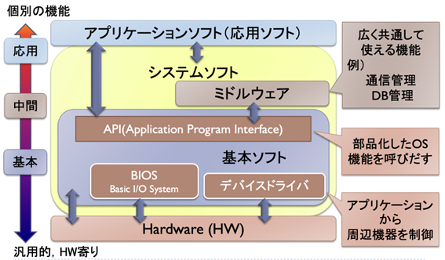

# ソフトウェア工学
## ソフトウェアについて

    
ソフトウェアは情報を扱うプロダクトそのもの、プロダクトを提供する手段である。ソフトウェアは劣化はしないが悪化はするため、新しい環境や技術ニーズを満たすビジネス要求に適用できるようにするように進化し続ける必要がある。また、より近代的なシステムやデータベースと相互運用するため拡張されなければならないという特徴もある。    
ソフトウェア工学とはIEEEによるとソフトウェアの開発、運用、メンテナンスに対するシステマティックで規律ある定量的なアプローチの適用をする学問であり、ソフトウェア工学の目的は進化論に基づく(ソフトウェアシステムが変化し続ける状況に対応する)方法論を考え出すことである。この学問はソフトウェアの大規模化と複雑化、IT人材の不足、社会性と求められるミッション、不確実性の増大などにより必要とされている。    
ソフトウェアの誕生からソフトウェアの廃止までのソフトウェアサイクルは以下のような手順で行われる。  
・企画・計画  
・要件定義  
・設計  
・制作  
・テストとデバック  
・運用・保守  
・廃止  
企画・計画ではビジネス上あるいはシステム上の要求を具現化するために行われる。要件定義ではシステムの目的、概要、機能、構成などを明確にし、スコープの共有や社内外への宣言と協力依頼、RFPなどのために行う。設計では要件定義書から設計書へと変えるもので、コーディングができるレベルの仕様書に落とし込む。制作では設計書に従いシステムを構成する。このとき、自社開発である内製と外部委託である調達に分かれるが、この際、賃金の安い海外企業に外部委託をするオフショア開発というものが行われることがある。テストとデバックでは、バグのないソフトウェアはないと考え、ソフトウェアのどの部分をテストし、どの程度テストするのかなどを決めテストを行う。    
プロジェクトは有期性と独自性を持ち、今の立ち位置から順に目標に進むフォアキャスティングと目標に向けて何が必要か計画し達成に向かうという逆算的なバックキャスティングがある。  

## ソフトウェア分析  
ソフトウェアを見える化するための手法として以下が挙げられる。  
・物量に関する分析  
・実行性能に関する分析  
・開発工数に関する分析  
・品質に関する分析  

## ソフトウェアの評価  
ソフトウェアの評価は価値を図ることで以下の方法で評価を行う。  
1. コードの物量(ステップ数) ・・・c言語換算でのソースコード数  
2. コードの物量(オブジェクト容量)  
3. ファンクションポイント法・・・プログラミングフェーズに入る前にユーザ要件が定まり、必要な機能が見えてきた段階でシステム規模を概算できる  
4. 使い勝手  

## 開発プロセス  
1. ウォーターフォール開発型プロセス  
要件定義から総合テストまでの工程を順番に行っていく開発方法であり、進捗管理が容易で成果物が明確であるというメリットがある一方、後工程にしわ寄せが行きやすい開発プロセスである。  
2. スパイラルモデル  
プログラム開発を小さなフェーズに分解し、フェーズごとにプロトタイプによるデモンストレーションを行い、フィードバックをする。プロトタイプ作成に想定外の作業量が発生するリスクがある。  
3. 反復型開発プロセス  
ソフトウェアを機能分割し、これを反復と呼ぶ単位で管理する。部分的に完成させるため顧客の要求を受け入れやすく、部分的に納品ができるが、全体像が見づらく分割のための作業が増え、一括して稼働するシステムで意味がなくなってしまう。  
4. アジャイルシステム  
変化に対応して無駄を排し、最適な手法で動くソフトウェアの提供を優先する。  
・スクラム  
アジャイル開発の代表的な手法であり、スプリントと役割分担に基づいて進行する。役割はプロダクトオーナー、スクラムマスター、開発チームに分かれ、1~4週間単位で開発を行う。  
・カンバン  
視覚的な作業管理ボードを用いてタスクの状態(To Do,In Orogress,Done)を見える化する。これにより、タスクの追加や変更が容易になることでプランニングが柔軟になったり、サイクル期間を短縮できたり、ワークフローを可視化できたりするメリットがある。  
・XP  
開発者の視点に特化したアジャイル手法で高品質コードと柔軟な変更対応を両立することを目的とする。  

これらの開発手法は重要度、人(メンバーのレベル)、規模(人数)、文化、変化の度合いをもとに決定するが、実際に現場ではこれらの開発手法を組み合わせたハイブリッド型が使われることが多くなっている。  

## WBS
WBSとはプロジェクト目標を達成し、必要な成果物を生成するためにプロジェクトチームが実行する作業を要素成果物を主体に要素分解したものである。WBSのメリットとしては  
1. スコープが明確になる  
2. 作業を洗い出せる  
3. 全体管理と作業計画が明確化される  
4. プロジェクト実施時はWBSに則り実行するだけ  
というのがあげられる。  

## コーディング
コードは書くよりも読まれることの方が多いため、他人が読みやすいコードを書く必要があり、ルールが存在する。例としてPythonのPep8のルールを以下に示す。  
1. 1行の長さを79文字以内にし、docstringやコメントは72文字以内にする。(行を継続する場合、折り返された要素は縦に揃える)  
2. 1レベルインデントを行う際はスペースを4つ使う  
3. 演算子の前後にスペース1ずつ空ける  
4. 無駄なスペースは明けない  
5. 改行を行うことで文を重ねない  
6. 演算子の位置を揃える  
7. importとは上から標準ライブラリ、サードパーティに関連するもの、ローカルなアプリケーション・ライブラリに特有のものの順に書く。  
8. コメントとコードを矛盾させず、複数の完全な文で書き、文はピリオドで終わる。また、コメントが2つ以上並ぶ場合、文の終わりにスペースを2つ入れる。  
9. コメントは誰が見てもわかりやすいようにし、英語で書くようにする
10. 命名規則を守る。[命名規則に関するルール](https://pep8-ja.readthedocs.io/ja/latest/#section-20)  
11. UTF-8以外のエンコーディングはできるだけ行わない  
12. ASCII以外の使用を極力避ける  
13. PEP8のスタイルに合わせることも重要だが、プロジェクト内で一貫性を持つことはもっと大事  
これらのルールを確認するチェックツールとしてflake8やpylintなどがある。これらを用いることによりエラーとしてルールに則っていないところが表示される。  

## バージョン管理
バージョン管理はファイルを「誰が」、「いつ」、「どのように」変更したかを管理し、多数のメンバーと共同でコード開発ができるようにするために行われる。

### 集中管理型
同時編集するとコンフリクトが発生しやすく、同期に時間がかかる。Subversionなどがあてはまる。  
### 分散管理型
リモートリポジトリへのアクセス頻度が低く、障害に頑健である。gitなどが用当てはまる。  

## git
元々はオープンソフトウェア管理のためのソフトウェアである。変更履歴が残り、変更した箇所に戻ることができ、他人と共同編集ができる。  
・コミット  
ファイル作成・変更・削除の記録であり、対称ファイルは1つでも複数でもよく、コミットの単位はユーザーが自由に決定する。  
・レポジトリ    
gitが管理するプロジェクトのフォルダであり、個々のプロジェクトの実行環境をローカルレポジトリ、共有の管理場所であるgithubやgitlabはリモートレポジトリという。   
・ブランチ  
作業を枝分かれさせることができ、共同作業・並行作業を可能にする。
・github  
リモートレポジトリのホスティングサービスの1つであり、オープンソフトウェアの主要なポータルサイトになっている。

## gitコマンド
[設定・確認系]  
・git init　gitの初期化・設定開始  
・git status　ワークツリーのステータスを表示  
・git config 　設定周りの確認・変更  
・git log　ログを表示-- onelineでコミットメッセージの1行のみの一覧を表示する  
・git diff　ファイルの差分を表示  
[コミット系]  
・git add　ステージングエリアに追加  
・git commit　コミットの実行  
[修正系]  
・git commit --amend 　コミットの修正  
・git checkout削除されたファイルを復旧や過去コミットの復元など  
・git reset　コミットのリセット  
・git revert　「コミットの変更を打ち消す」コミット  
・git rm　ファイルとindex情報の削除  
[リモート系]  
・git clone　レポジトリをコピー  
・git pull　リモートレポジトリの同期	  
・git push変更をアップロードする  
・git request-pull　プルリクエスト：変更依頼  
・git remote　リモートレポジトリの設定  
[ブランチ系]  
・git branch　ブランチの作成  
・git checkout　ブランチの切り替え  
・git merge　ブランチの統合  
・git clone　レポジトリをコピー  
・git push変更をアップロードする  

## CI/CD
### CI/CDとは
CIとはコード変更と共有レポジトリに頻繁に統合するプロセスである。自動テストとビルドを定期的に実行し、バグの早期発見と修正を可能にし、CIを自動化することによって開発をスムーズに進行することを促進する。CDとはコード変更をテスト環境や本番環境に自動的にデプロイするプロセスである。自動デプロイメントを組み込み、手動操作によるデプロイの必要性を排除し、CDにより、ユーザーフィードバックを迅速に反映できるようにする。

### CI/CDパイプラインの基本的ステップ
1. ソース: コード変更をトリガーにワークフローを起動
2. ビルド: ソースコードをコンパイル
3. テスト: 自動テストを実行
4. デプロイ: テスト済みのコードを本番環境にデプロイ
5. 検証: デプロイされたアプリケーションの動作確認
6. モニタリング: 本番環境での継続的な監視

### GitHubActionsを使用したCI/CD
1. ワークフローの定義: YAMLファイルで定義し、 .github/workflows/ディレクトリに配置. イベント、ジョブ、ステップで構成  
2. トリガー:  プッシュ、プルリクエスト、スケジュールなど様々なイベントでワークフローを起動可能  
3. ジョブとステップ: ジョブは並列実行が可能. ステップでは、シェルコマンドの実行やアクションの使用が可能  
4. アクション: 再利用可能なワークフローの構成要素. コミュニティが作成したアクションも利用可能  
5. ランナー:  GitHub提供のホステッドランナーまたはセルフホステッドランナーを使用可能  

### CI/CDの実践
Githubにあるリモートレポジトリの内容をwebpageとして公開することができる。HPの更改はCI/CDによって自動化することができ、Jekyllを使用することでmakedownファイルを自動的にhtml化することができる。

## まとめ
この講義ではソフトウェア工学の基礎的な概念やソフトウェア開発に関する知識などを学ぶことができた。flake8を用いたコードのチェックやプロジェクトで開発する際のGithubを用いた方法などを実際に確かめながら学ぶことができたため、理論だけでなく実践的なスキルも同時に身に付けることができた。